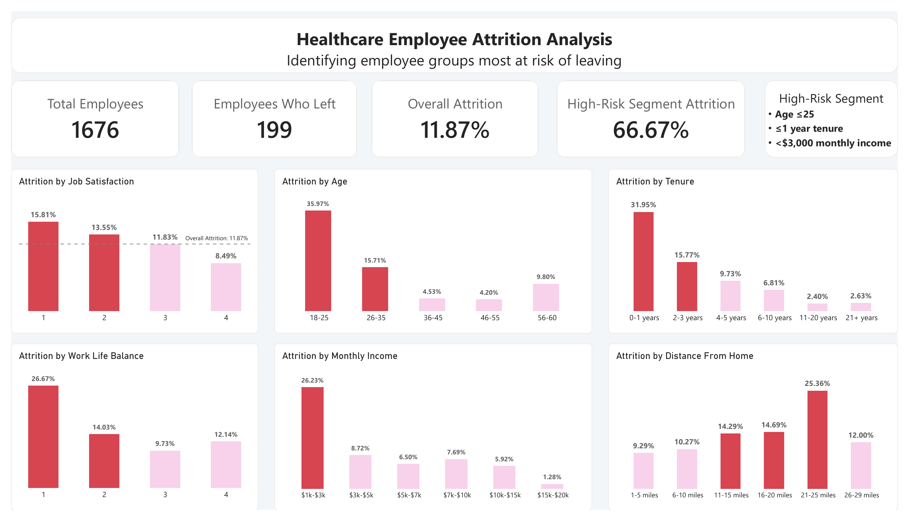
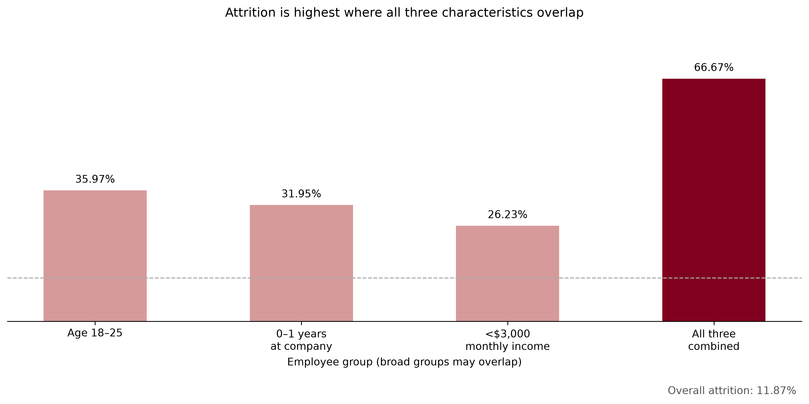
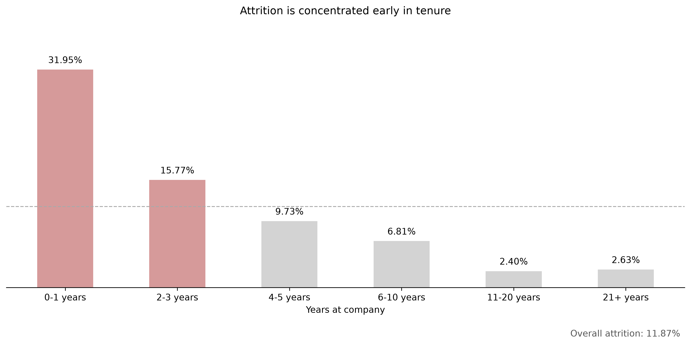

# Healthcare Employee Attrition Analysis | Python, Pandas & Power BI

An analysis of 1,676 healthcare employee records, examining how attrition varies across employee characteristics and where retention efforts could be focused. Developed as part of the Data In Motion bootcamp.

## Business questions

- Which employee groups have the highest observed attrition rates?
- How do tenure, monthly income, age, job satisfaction, work-life balance and distance from home relate to attrition?
- How does attrition differ when younger age, short tenure and lower income occur together?
- What retention actions are supported by these descriptive findings?

## Executive overview

| Metric | Result |
| --- | ---: |
| Total employees | 1,676 |
| Employees who left | 199 |
| Overall attrition rate | 11.87% |
| Employees meeting all three segment conditions | 48 |
| Departures within that segment | 32 |
| Attrition within that segment | 66.67% |

The combined segment includes employees aged **25 or younger**, with **one year or less at the company**, earning **less than $3,000 per month**. It represents **2.86% of employees** and **16.08% of all departures**. The 66.67% figure is the observed rate within those 48 employees, not a prediction for an individual employee.

## Findings and business implications

1. **Attrition is concentrated early in tenure.** Employees with 0–1 years at the company have a 31.95% attrition rate, compared with 11.87% overall. The rate falls to 15.77% at 2–3 years and 9.73% at 4–5 years. Structured onboarding, 30/60/90-day check-ins and early manager support are priorities to investigate.
2. **Younger and lower-paid groups have elevated attrition.** Employees aged 18–25 have a 35.97% rate; employees earning under $3,000 per month have a 26.23% rate. Review compensation competitiveness and progression opportunities while considering the overlap with tenure.
3. **The overlap identifies a small group with high observed attrition.** Thirty-two of the 48 employees meeting all three conditions left. This supports focused investigation, but does not establish that the conditions independently cause attrition or that their effects compound mathematically.
4. **Employee-experience measures provide additional signals.** Attrition declines from 15.81% at Job Satisfaction Level 1 to 8.49% at Level 4. Work-Life Balance Level 1 has 26.67% attrition, but the full WLB pattern is not consistently declining. Investigate workload, scheduling and manager support.
5. **Commute patterns are uneven.** The 21–25-mile group has 25.36% attrition, while the 26–29-mile group has 12.00%. Explore commute support or flexibility without assuming that attrition always rises with distance.

### Broad groups versus isolated conditions

The broad groups above overlap. The following comparison excludes the other two conditions from each “only” group:

| Segment | Employees | Departures | Attrition |
| --- | ---: | ---: | ---: |
| Age ≤25, tenure >1 year, income ≥$3,000 | 49 | 7 | 14.29% |
| Tenure ≤1 year, age >25, income ≥$3,000 | 105 | 15 | 14.29% |
| Income <$3,000, age >25, tenure >1 year | 270 | 46 | 17.04% |
| Age ≤25, tenure ≤1 year, income <$3,000 | 48 | 32 | 66.67% |

These are descriptive subgroup comparisons. They do not control for other employee differences and are not estimates of independent effects. The four rows do not cover the whole workforce: employees meeting two conditions or none are not shown.

## Method and metric definitions

- Each source row represents one employee. Validation of the supplied CSV found 1,676 unique employee IDs, 35 columns, no missing values and no duplicate rows.
- **Attrition rate** is the number of rows with `Attrition = "Yes"` divided by the employee count in the relevant group.
- Pandas `crosstab(..., normalize="index")` calculates within-group proportions. Multiplying by 100 gives percentage-point values; `.style.format("{:.2f}%")` formats their display while retaining numeric values.
- `pd.cut()` creates age, income, distance and tenure categories. Tenure boundaries start at `-1` so employees with zero years are included in the first right-closed interval.
- Pandas Boolean filters identify the overlapping and isolated-condition segments. Their rates are calculated from the records rather than by multiplying individual group rates.
- Python/Pandas supported validation, grouping and exploratory analysis. Matplotlib supported the presentation charts. The source required no missing-value imputation or duplicate removal; avoid describing this as extensive data cleaning.
- Power BI imported employee-level data and independently calculated dashboard KPIs using DAX. Grouping and numeric sort columns support the charts. Python results served as validation checks.
- `TrainingTimesLastYear` measures training frequency, not hours. Availability of career-development opportunities is not directly recorded.

## Power BI dashboard

The Power BI dashboard summarizes employee attrition through four KPI cards and six charts covering job satisfaction, age, tenure, work-life balance, monthly income, and distance from home. The high-risk segment definition appears beside its KPI card.

Python/Pandas was used to analyze the data and identify employee segments. Power BI used DAX to calculate dashboard KPIs from the employee-level data, with Python results used to verify the numbers. The screenshot below shows the completed dashboard built in Power BI Desktop.

## Python charts

The first three bars include overlapping employee populations. They are not the “only” groups in the isolated-condition table above.

## Project files

| File | Purpose |
| --- | --- |
| [healthcare_employee_attrition.ipynb](healthcare_employee_attrition.ipynb) | Pandas analysis, explanations, executed outputs and Matplotlib chart generation |
| [figures/](figures/) | Five charts exported from calculated results |
| [data/README.md](data/README.md) | Dataset source and local placement instructions |
| [requirements.txt](requirements.txt) | Python analysis and notebook dependencies |
| [presentation/healthcare_employee_attrition.pptx](presentation/healthcare_employee_attrition.pptx) | Original completed seven-slide presentation |

## Running the analysis

### Google Colab

Open `healthcare_employee_attrition.ipynb` in Colab, then run the cells in order. If the dataset is absent, the first code cell offers a file-upload prompt. Upload an authorized copy named exactly `watson_healthcare_modified2.csv`. A fresh runtime may require uploading it again.

### Local Jupyter

1. Download this repository and open a terminal in its root folder.
2. Use Python 3.12 and install the dependencies: `python -m pip install -r requirements.txt`.
3. Place an authorized copy of the CSV in `data/`.
4. Start JupyterLab with `python -m jupyterlab` and open `healthcare_employee_attrition.ipynb`.
5. Restart the kernel and run all cells. The final reconciliation cell checks the KPIs, segment counts, category coverage and six chart series.

The notebook saves five PNGs to `figures/`. It uses relative paths, so no changes to personal file paths are required. The original working notebook was reorganized for this repository; repeated setup and draft visuals were removed, table formatting was corrected to preserve numbers, and chart values were connected to the calculations. The isolated-condition follow-up remains separate from the broad-group chart.

**Validation:** All 59 code cells ran from a fresh local kernel with Python 3.12.14, Pandas 3.0.1, NumPy 2.5.3 and Matplotlib 3.11.2. All reconciliation checks passed, and five PNGs were regenerated. The Colab upload branch has not been separately exercised. The presentation is the original completed deck; its broad-group findings precede the isolated-condition follow-up now included in the notebook.

## Dataset reference and limitations

Kevin Serizawa obtained `watson_healthcare_modified2.csv` directly from **Data In Motion** for the bootcamp milestone. The upstream origin and redistribution terms have not been confirmed. The raw CSV is therefore excluded from the public repository. Obtain an authorized copy from the course provider to rerun the analysis.

- Findings describe the supplied dataset, not a verified current healthcare workforce or a specified annual attrition period.
- Relationships are observational. No causal model, predictive validation or statistical-significance test is presented.
- The combined segment contains only 48 employees, so its percentage should always be accompanied by its denominator.
- The distribution of satisfaction ratings among high-risk leavers does not establish why they left. It must not be mistaken for a rate comparing leavers and stayers within each rating.
- The source has both `Admin` and `Administrative` job-role labels. Their equivalence has not been confirmed; preserve them separately when reproducing the original analysis.
- Age is used to describe historical patterns. Retention recommendations focus on support, compensation and working conditions rather than adverse decisions based on age.
